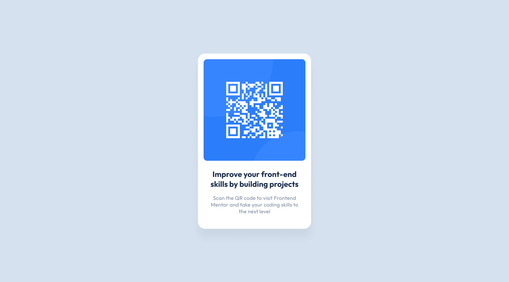

# Frontend Mentor - QR code component solution

This is a solution to the [QR code component challenge on Frontend Mentor](https://www.frontendmentor.io/challenges/qr-code-component-iux_sIO_H).

## Table of contents

- [Overview](#overview)
  - [Screenshot](#screenshot)
  - [Links](#links)
  - [Built with](#built-with)
- [Author](#author)

## Overview

### Screenshot

### Links

- Solution URL: [https://www.frontendmentor.io/solutions/qr-code-component-Q0Ywh5KoPD](https://www.frontendmentor.io/solutions/qr-code-component-Q0Ywh5KoPD)
- Live Site URL: [https://annazofka.github.io/qr-code-component/](https://annazofka.github.io/qr-code-component/)

### Built with

- Semantic HTML5 markup
- CSS custom properties
- Flexbox

## Author

- Frontend Mentor - [@annazofka](https://www.frontendmentor.io/profile/annazofka)
